<p align="center">
  
</p>

<h1 align="center">🔴 BLUFFBUSTER 🔴</h1>

<p align="center">
  <strong>Forensic Pitch Deck Analysis — Lies are obvious. Exaggerated truths aren't.</strong>
</p>

<p align="center">
  
  
  
  
  
  
</p>

<p align="center">
  <em>A multi-agent AI system that forensically dissects startup pitch decks,<br/>
  cross-references every claim against live web evidence, and stages an<br/>
  adversarial courtroom-style debate between a Defender and Prosecutor agent.</em>
</p>

---

## 📑 Table of Contents

- [The Problem](#-the-problem)
- [The Solution](#-the-solution)
- [Key Features](#-key-features)
- [Architecture Overview](#-architecture-overview)
- [Multi-Agent Pipeline (LangGraph)](#-multi-agent-pipeline-langgraph)
  - [Founder Mode Pipeline](#founder-mode-pipeline)
  - [VC Mode Pipeline](#vc-mode-pipeline)
  - [Agent Descriptions](#agent-descriptions)
- [Frontend Architecture](#-frontend-architecture)
  - [Landing Page Sections](#landing-page-sections)
  - [Dashboard Components](#dashboard-components)
  - [Design System](#design-system)
- [API Reference](#-api-reference)
- [Database Schema](#-database-schema)
- [Technology Stack](#-technology-stack)
- [Project Structure](#-project-structure)
- [Getting Started](#-getting-started)
- [Configuration](#-configuration)
- [Use Cases](#-use-cases)
- [How It Differs from ChatGPT](#-how-it-differs-from-chatgpt)
- [Performance & Optimization](#-performance--optimization)
- [Future Roadmap](#-future-roadmap)
- [License](#-license)

---

## 🔥 The Problem

Every year, **thousands of pitch decks** are presented to investors. The harsh reality:

| Problem | Impact |
|---------|--------|
| **73% of pitch decks contain exaggerated TAM claims** | Investors waste diligence cycles on inflated markets |
| **Founders unknowingly cite stale data** | Claims that were true 6 months ago are false today |
| **"AI-powered" is the new "blockchain-powered"** | Buzzword density correlates inversely with substance |
| **No one fact-checks slide 7** | Financial projections go unchallenged until the term sheet |

The industry's current "solution" is to paste the deck into ChatGPT and ask *"Is this legit?"*. ChatGPT gives you **an opinion**. BluffBuster gives you **evidence with receipts**.

---

## 💡 The Solution

BluffBuster is a **forensic AI system** that:

1. **Extracts** every factual, quantitative, and comparative claim from a pitch deck PDF
2. **Searches** the live web (DuckDuckGo + Jina AI Reader) for corroborating or contradicting evidence
3. **Verifies** each claim as `VERIFIED`, `EXAGGERATED`, `FALSE`, or `UNVERIFIABLE` using a cynical LLM judge
4. **Debates** the most contentious claims in an adversarial courtroom between a Defender and Prosecutor agent
5. **Visualizes** every finding on a per-page Truth Heatmap with a weighted trust score

All of this happens in **under 90 seconds** through batched LLM calls and parallel web scraping.

---

## 🎯 Key Features

### Dual-Mode Analysis

| Feature | Founder Mode 🟢 | VC Mode 🟡 |
|---------|-----------------|------------|
| **Perspective** | Helps founders strengthen their deck | Helps investors find red flags |
| **First Impression** | ✅ Analyzes first 3 slides for hook strength | ❌ |
| **Claim Repair** | ✅ Suggests rewritten, defensible claims | ❌ |
| **Financial Stress Test** | ✅ Benchmarks projections against industry data | ❌ |
| **Competitor Blind Spots** | ✅ Finds unmentioned competitors | ❌ |
| **Red Flag Scoring** | ❌ | ✅ Weighted severity scoring |
| **Domain Credibility** | ❌ | ✅ Cross-references domain expertise |
| **Competitor Mapping** | ❌ | ✅ Maps competitor trajectories & funding |
| **Investor Fingerprint** | ❌ | ✅ Biases analysis to a specific VC's thesis |
| **Adversarial Debate** | ✅ | ✅ |
| **Truth Heatmap** | ✅ | ✅ |
| **Temporal Claim Decay** | ✅ | ✅ |

### Investor Fingerprint System (VC Mode)

Analyze a deck through the lens of a specific VC firm's investment thesis:

| Persona | Thesis Focus | Red Flag Priority |
|---------|-------------|-------------------|
| **Standard** | Balanced forensic audit | Verify everything. Trust no one without proof. |
| **Sequoia Capital** | Market dominance & durable moats | TAM is everything. Penalize small markets brutally. |
| **Y Combinator** | Velocity, simplicity, founder-market fit | Dislike bloated tech stacks and slow launch cycles. |
| **Tiger Global** | Aggressive scale & market landgrabs | Obsessed with YoY revenue growth and GMV velocity. |
| **Benchmark** | Product-led growth & unit economics | Penalize high CAC and marketing-led growth. |

---

## 🏗 Architecture Overview

```
┌─────────────────────────────────────────────────────────────────────┐
│                        CLIENT (Browser)                             │
│  ┌──────────────┐  ┌──────────────┐  ┌───────────────────────────┐ │
│  │  Landing Page │  │  File Upload │  │   Analysis Dashboard      │ │
│  │  (Retro UI)   │  │  (PDF Drop)  │  │   (Live Results)          │ │
│  └──────┬───────┘  └──────┬───────┘  └──────────┬────────────────┘ │
│         │                  │                     │                   │
│         └──────────────────┼─────────────────────┘                   │
│                            │  REST API + WebSocket                   │
└────────────────────────────┼─────────────────────────────────────────┘
                             │
                             ▼
┌─────────────────────────────────────────────────────────────────────┐
│                     FASTAPI SERVER (:8000)                           │
│  ┌─────────────┐  ┌──────────────┐  ┌──────────────────────────┐   │
│  │ PDF Upload   │  │ Session Mgmt │  │ WebSocket Streaming      │   │
│  │ & Extraction │  │ (SQLite)     │  │ (Live Status Polling)    │   │
│  └──────┬──────┘  └──────┬───────┘  └──────────────────────────┘   │
│         │                │                                           │
│         ▼                ▼                                           │
│  ┌─────────────────────────────────────────────────────────────┐    │
│  │              LangGraph StateGraph Pipeline                   │    │
│  │                                                              │    │
│  │  ┌──────────┐  ┌──────────┐  ┌──────────┐  ┌──────────┐   │    │
│  │  │ Extract  │→ │ Verify   │→ │ Temporal │→ │ Repair/  │   │    │
│  │  │ Claims   │  │ Claims   │  │ Decay    │  │ Red Flag │   │    │
│  │  └──────────┘  └──────────┘  └──────────┘  └──────────┘   │    │
│  │       │             │              │             │          │    │
│  │       ▼             ▼              ▼             ▼          │    │
│  │  ┌──────────┐  ┌──────────┐  ┌──────────┐  ┌──────────┐   │    │
│  │  │ First    │  │ Financial│  │ Adversar.│→ │ Truth    │   │    │
│  │  │ Impress. │  │ Stress   │  │ Debate   │  │ Heatmap  │   │    │
│  │  └──────────┘  └──────────┘  └──────────┘  └──────────┘   │    │
│  └─────────────────────────────────────────────────────────────┘    │
│                            │                                         │
│                            ▼                                         │
│  ┌──────────────────────────────────────────────────────────────┐   │
│  │                  External Services                            │   │
│  │  ┌──────────┐  ┌──────────┐  ┌──────────┐  ┌──────────────┐│   │
│  │  │ LLM API  │  │ DuckDuck │  │ Jina AI  │  │ ChromaDB     ││   │
│  │  │(AICredits│  │ Go Search│  │ Reader   │  │ (Embeddings) ││   │
│  │  │ / Llama) │  │          │  │          │  │              ││   │
│  │  └──────────┘  └──────────┘  └──────────┘  └──────────────┘│   │
│  └──────────────────────────────────────────────────────────────┘   │
└─────────────────────────────────────────────────────────────────────┘
```

---

## 🤖 Multi-Agent Pipeline (LangGraph)

BluffBuster uses **LangGraph's `StateGraph`** to orchestrate a deterministic pipeline of specialized AI agents. Each agent is a node in the graph that reads from and writes to a shared `AnalysisState` object.

### State Schema

```python
class AnalysisState(TypedDict):
    session_id: str
    mode: str                    # "founder" or "vc"
    pages: list[dict]            # Raw extracted PDF pages
    full_text: str               # Concatenated deck text
    claims: list[dict]           # Extracted claims
    claim_results: list[dict]    # Verified claims with verdicts
    first_impression: dict       # First 3-slide analysis (Founder only)
    financial_stress: dict       # Financial stress test (Founder only)
    competitors: dict            # Competitor analysis
    red_flags: dict              # Red flag scores (VC only)
    domain_credibility: dict     # Domain credibility (VC only)
    debate: list[dict]           # Adversarial debate messages
    heatmap: list[dict]          # Per-page truth heatmap
    overall_trust_score: float   # Weighted trust score (0.0 – 1.0)
    investor_persona: str        # VC persona ID
```

### Founder Mode Pipeline

```mermaid
graph LR
    A["Extract Claims"] --> B["First Impression"]
    B --> C["Verify Claims"]
    C --> D["Temporal Decay"]
    D --> E["Claim Repair"]
    E --> F["Financial Stress"]
    F --> G["Competitor Blind"]
    G --> H["Adversarial Debate"]
    H --> I["Truth Heatmap"]
    I --> J["END"]

    style A fill:#00C896,stroke:#0A0A0F,color:#0A0A0F
    style C fill:#FF3D3D,stroke:#0A0A0F,color:#fff
    style H fill:#FF9500,stroke:#0A0A0F,color:#0A0A0F
    style I fill:#FF3D3D,stroke:#0A0A0F,color:#fff
```



### VC Mode Pipeline

```mermaid
graph LR
    A["Extract Claims"] --> B["Verify Claims"]
    B --> C["Temporal Decay"]
    C --> D["Competitor Mapper"]
    D --> E["Red Flag Scorer"]
    E --> F["Domain Credibility"]
    F --> G["Adversarial Debate"]
    G --> H["Truth Heatmap"]
    H --> I["END"]

    style A fill:#00C896,stroke:#0A0A0F,color:#0A0A0F
    style B fill:#FF3D3D,stroke:#0A0A0F,color:#fff
    style G fill:#FF9500,stroke:#0A0A0F,color:#0A0A0F
    style H fill:#FF3D3D,stroke:#0A0A0F,color:#fff
```



### Agent Descriptions

#### 1. Claim Extractor (`services/claim_extractor.py`)
- **Input:** Full deck text
- **Output:** List of `{text, page_number, category, context}`
- **Method:** Single LLM call with a structured extraction prompt
- **Categories:** `tam`, `growth`, `competitor`, `financial`, `technical`, `team`, `general`

#### 2. Claim Verifier (`agents/claim_verifier.py`)
- **Input:** List of extracted claims
- **Output:** Enriched claims with `verdict`, `confidence`, `reasoning`, `evidence_sources`
- **Method:** Batch verification — all claims are sent in a single LLM call with `[ID: CX]` tags for 1:1 mapping
- **Evidence Pipeline:**
  1. Each claim → DuckDuckGo search (5 results)
  2. Top result → Jina AI Reader (full-page markdown scrape)
  3. Keyword-based context extraction from scraped page
  4. All evidence bundled into one mega-prompt
- **Verdicts:** `VERIFIED` | `EXAGGERATED` | `FALSE` | `UNVERIFIABLE`
- **Cynical Judge Mode:** The system prompt instructs the LLM to act as a "Hard Judge" — hyperbolic claims default to `EXAGGERATED` or `FALSE`, never `UNVERIFIABLE`

#### 3. Temporal Decay Agent (`agents/temporal_decay.py`)
- **Input:** Verified claims + full deck text
- **Output:** Claims enriched with `temporal_decay.freshness_score`, `estimated_expiry`, `decay_reasoning`
- **Method:**
  1. Identifies sector from claim categories
  2. Fetches live market velocity data via DuckDuckGo (recent funding rounds, new entrants)
  3. Batch LLM call assesses how quickly each claim will "expire" based on competitive dynamics
- **Use Case:** A claim like *"We are the only player in X"* might have a freshness score of 0.3 if 5 new competitors raised funding in the last quarter

#### 4. First Impression Analyzer (`agents/first_impression.py`) — *Founder Mode Only*
- **Input:** Text of first 3 slides
- **Output:** `{problem_clarity, hook_strength, solution_comprehension, overall_score, feedback, rewrites[]}`
- **Method:** LLM evaluates the opening slides for persuasive impact
- **Rewrites:** Provides concrete, rewritten versions of weak slides

#### 5. Claim Repair Agent (`agents/claim_repair.py`) — *Founder Mode Only*
- **Input:** Verified claim results
- **Output:** Claims enriched with `repair_suggestion`
- **Method:** For each `FALSE` or `EXAGGERATED` claim, the LLM generates a defensible, rewritten version backed by the evidence already found

#### 6. Financial Stress Test (`agents/financial_stress.py`) — *Founder Mode Only*
- **Input:** Full deck text
- **Output:** `{projections_found[], benchmarks[], flags[], overall_plausibility}`
- **Method:** Extracts financial projections → benchmarks them against industry medians → flags outliers (e.g., "100% YoY for 5 years" vs. SaaS median of 30%)

#### 7. Competitor Blind Spot Detector (`agents/competitor_blind.py`) — *Founder Mode Only*
- **Input:** Full deck text
- **Output:** Missing competitors the founder failed to mention
- **Method:** LLM identifies the startup's market → lists known competitors not present in the deck

#### 8. Competitor Mapper (`agents/competitor_mapper.py`) — *VC Mode Only*
- **Input:** Full deck text
- **Output:** Detailed competitor profiles with funding, trajectory, and comparison points
- **Method:** LLM + search provides structured competitive intelligence

#### 9. Red Flag Scorer (`agents/red_flag_scorer.py`) — *VC Mode Only*
- **Input:** Verified claim results + investor persona
- **Output:** Weighted red flags with severity levels (`critical`, `major`, `minor`)
- **Method:** Scores claims through the lens of the selected VC's investment thesis (e.g., Sequoia penalizes small TAMs brutally, Benchmark penalizes high CAC)

#### 10. Domain Credibility Checker (`agents/domain_credibility.py`) — *VC Mode Only*
- **Input:** Full deck text + claim results
- **Output:** Domain expertise assessment
- **Method:** Cross-references the founding team's claims about domain expertise with the quality or lack of substance in their technical claims

#### 11. Adversarial Debate Engine (`agents/graph.py → node_debate`)
- **Input:** Top 3 most contentious claims (those with `FALSE` or `EXAGGERATED` verdicts)
- **Output:** `debate[]` — alternating `defender` and `prosecutor` messages
- **Method:**
  1. Claims are formatted with `[ID: DX]` tags
  2. A single batch LLM call generates both sides of the argument
  3. **Defender** argues in favor of the founder — finding reasonable interpretations
  4. **Prosecutor** argues against — citing specific evidence and data
  5. The user can **intervene** via the `/api/debate/{id}/intervene` endpoint, which triggers a Judge agent to issue a ruling

#### 12. Truth Heatmap Generator (`agents/graph.py → node_heatmap`)
- **Input:** All verified claim results
- **Output:** Per-page heatmap entries + weighted overall trust score
- **Scoring:**
  - `VERIFIED` = 1.0, `EXAGGERATED` = 0.5, `FALSE` = 0.0, `UNVERIFIABLE` = 0.5
  - Page color: >0.7 = 🟢 Green, 0.3–0.7 = 🟡 Amber, <0.3 = 🔴 Red
- **Weighted Trust Score:** Business-critical categories (`tam`, `growth`, `financial`, `competitor`) are weighted 3x more than soft categories (`team`, `technical`, `general`)

---

## 🎨 Frontend Architecture

The frontend is a React 19 single-page application built with **Vite**, **TailwindCSS 4**, **Framer Motion**, **GSAP**, and **Zustand** for state management.

### Design Philosophy: Retro Arcade × Dark Forensics

The UI uses a **strict 4-color palette** inspired by forensic laboratory aesthetics:

| Color | Hex | Role |
|-------|-----|------|
| 🔴 Red | `#FF3D3D` | Danger, false claims, critical alerts |
| 🟡 Amber | `#FF9500` | Warnings, exaggerated claims, caution |
| 🟢 Green | `#00C896` | Verified, safe, confirmed claims |
| ⚫ Black | `#0A0A0F` | Background, depth, canvas |
| ⚪ Off-White | `#E8E6E3` | Primary text, labels |
| 🔘 Muted | `#6B6B7B` | Secondary text, descriptions |

### Typography

| Font | Usage |
|------|-------|
| **Press Start 2P** | Pixel art headings, retro UI labels, data tags |
| **Bebas Neue** | Large section titles, dramatic headers |

### Landing Page Sections

The landing page is a full-screen scrolling experience composed of these sections:

```
LandingPage.tsx
├── ScrollProgress        — Top-fixed red progress bar
├── Hero                  — Full-screen retro arcade splash
│   ├── SVG Wave Layers   — 3 layered waves (green, amber, dark)
│   ├── Floating Symbols  — $, !, ?, X, %, # (forensic-themed pixel art)
│   ├── 3D Pixel Title    — "BLUFFBUSTER" in Press Start 2P with CSS extrusion
│   └── CTA Buttons       — "Founder Mode" / "VC Mode" with press animations
├── ProblemSection        — Horizontal scroll cards (GSAP ScrollTrigger)
├── HowItWorks            — Sticky timeline + animated content panels
├── FounderMode           — Feature breakdown with file upload
├── VCMode                — Feature breakdown with persona selector
├── WowMoment             — Highlight reel of standout features
├── ChatGPTComparison     — Side-by-side comparison grid
├── FallingPatternDemo    — Interactive demo element
└── Closing               — Full retro-styled outro with SVG waves
```

### Dashboard Components

After uploading a deck, the user lands on `Dashboard.tsx` which dynamically renders:

| Component | Description |
|-----------|-------------|
| `ClaimAutopsy` | Grid of all claims with verdict badges, confidence bars, and evidence |
| `AdversarialDebate` | Live chat-style debate between Defender 🟢 and Prosecutor 🔴 |
| `RedFlagReport` | Sorted red flags with severity indicators (VC mode) |
| `FirstImpressionAnalyzer` | Radar chart of slide-1–3 scores with feedback (Founder mode) |
| `FinancialStressTest` | Projection analysis with plausibility flags |
| `CompetitorMap` | Competitor cards with funding data and trajectory |
| `ClaimRepairFeed` | Before/after claim rewrites (Founder mode) |
| `ClaimDecayVisualizer` | Temporal freshness scores with expiry estimates |
| `DomainForensics` | Domain credibility assessment (VC mode) |
| `BlindSpotDetector` | Unmentioned competitor warnings (Founder mode) |
| `InvestorFingerprint` | Selected persona details and thesis bias (VC mode) |
| `PersonaSelector` | Investor persona dropdown with firm branding |

### Design System

#### Glass Morphism
Every card uses the `.glass` CSS utility:
```css
.glass {
  background: rgba(19, 19, 26, 0.4);
  backdrop-filter: blur(32px) saturate(200%);
  border: 1px solid rgba(255, 255, 255, 0.05);
  box-shadow: 0 12px 40px rgba(0, 0, 0, 0.6);
}
```

Variants: `.glass-green`, `.glass-amber`, `.glass-red` apply tinted borders and shadows.

#### Neon Hover Animations
Interactive elements use pulsing neon keyframe animations:
```css
.neon-hover-red:hover {
  animation: neonPulseRed 1.5s infinite ease-in-out;
  /* Applies red glow + border pulse */
}
```

#### Spotlight Cards
The `ClaimAutopsy` and `RedFlagReport` components use mouse-tracking radial gradients via the `.spotlight-card` class, creating a flashlight effect as the cursor moves over cards.

#### Global Animated Background
Three massive, slowly orbiting gradient blobs (Red, Amber, Green) are rendered as `fixed` elements in `App.tsx`. They use a custom `@keyframes blob` animation with `mix-blend-screen` and `blur(120px)` to create a constantly shifting, deeply colored ambient atmosphere behind all screens.

#### CRT Scanline Overlay
A subtle scanline effect (`.crt-overlay`) is applied globally for retro authenticity.

---

## 📡 API Reference

Base URL: `http://localhost:8000`

### `POST /api/analyze`

Upload a pitch deck PDF and start analysis.

| Parameter | Type | Required | Description |
|-----------|------|----------|-------------|
| `file` | `File` | ✅ | PDF file (max 20MB) |
| `mode` | `string` | ✅ | `"founder"` or `"vc"` |
| `persona` | `string` | ❌ | Investor persona ID (default: `"standard"`) |

**Response:**
```json
{
  "session_id": "a1b2c3d4",
  "mode": "vc",
  "filename": "pitch.pdf",
  "pages_extracted": 15,
  "status": "processing",
  "message": "Analysis started. Poll GET /api/session/{session_id} for results."
}
```

### `GET /api/session/{session_id}`

Poll for analysis results.

**Response (processing):**
```json
{
  "session_id": "a1b2c3d4",
  "status": "processing",
  "results": null
}
```

**Response (complete):**
```json
{
  "session_id": "a1b2c3d4",
  "status": "complete",
  "results": {
    "claims": [...],
    "claim_results": [...],
    "first_impression": {...},
    "financial_stress": {...},
    "competitors": {...},
    "debate": [...],
    "heatmap": [...],
    "overall_trust_score": 0.63
  }
}
```

### `GET /api/session/{session_id}/heatmap`

Get the per-page truth heatmap data.

**Response:**
```json
{
  "session_id": "a1b2c3d4",
  "heatmap": [
    {
      "page_number": 1,
      "claims": [...],
      "page_score": 0.85,
      "dominant_color": "green"
    },
    {
      "page_number": 3,
      "claims": [...],
      "page_score": 0.25,
      "dominant_color": "red"
    }
  ],
  "overall_trust_score": 0.63
}
```

### `POST /api/debate/{session_id}/intervene`

User intervenes in the adversarial debate by directing the Judge.

**Request Body:**
```json
{
  "message": "I think the growth rate claim is defensible because...",
  "claim": "We grew 400% YoY"
}
```

**Response:**
```json
{
  "ruling": {
    "verdict": "PARTIALLY_SUSTAINED",
    "reasoning": "The growth rate is technically accurate but..."
  },
  "claim": "We grew 400% YoY"
}
```

### `WebSocket /ws/{session_id}`

Live streaming of analysis progress.

**Messages sent by server:**
```json
{"type": "status",            "data": {"status": "processing"}}
{"type": "analysis_complete",  "data": {/* full results */}}
{"type": "error",             "data": {"message": "Analysis failed"}}
```

---

## 🗄 Database Schema

BluffBuster uses **SQLite** for lightweight session persistence.

```sql
-- Analysis sessions
CREATE TABLE sessions (
  id           TEXT PRIMARY KEY,       -- UUID-based session ID
  mode         TEXT NOT NULL,          -- 'founder' or 'vc'
  filename     TEXT,                   -- Original PDF filename
  status       TEXT DEFAULT 'processing',  -- processing | complete | error
  created_at   TEXT DEFAULT CURRENT_TIMESTAMP,
  updated_at   TEXT DEFAULT CURRENT_TIMESTAMP
);

-- Extracted page content
CREATE TABLE pages (
  id           INTEGER PRIMARY KEY AUTOINCREMENT,
  session_id   TEXT NOT NULL REFERENCES sessions(id),
  page_number  INTEGER NOT NULL,
  text_content TEXT
);

-- Individual claim verdicts
CREATE TABLE claims (
  id                INTEGER PRIMARY KEY AUTOINCREMENT,
  session_id        TEXT NOT NULL REFERENCES sessions(id),
  claim_text        TEXT NOT NULL,
  page_number       INTEGER,
  category          TEXT,             -- tam, growth, financial, etc.
  verdict           TEXT,             -- VERIFIED, FALSE, EXAGGERATED, UNVERIFIABLE
  confidence        REAL DEFAULT 0.0,
  reasoning         TEXT,
  evidence_sources  TEXT,             -- JSON array of source objects
  repair_suggestion TEXT              -- Founder mode only
);

-- Adversarial debate messages
CREATE TABLE debate_messages (
  id           INTEGER PRIMARY KEY AUTOINCREMENT,
  session_id   TEXT NOT NULL REFERENCES sessions(id),
  role         TEXT NOT NULL,         -- 'defender' or 'prosecutor'
  content      TEXT NOT NULL,
  sources      TEXT,                  -- JSON array
  claim_ref    TEXT,                  -- Which claim this argues about
  created_at   TEXT DEFAULT CURRENT_TIMESTAMP
);

-- Full analysis result (JSON blob)
CREATE TABLE analysis_results (
  id           INTEGER PRIMARY KEY AUTOINCREMENT,
  session_id   TEXT NOT NULL UNIQUE REFERENCES sessions(id),
  result_json  TEXT NOT NULL          -- Complete serialized analysis state
);
```

Additionally, **ChromaDB** (in-memory) stores claim embeddings for semantic similarity search using the `all-MiniLM-L6-v2` sentence transformer model.

---

## 🛠 Technology Stack

### Backend

| Technology | Version | Purpose |
|-----------|---------|---------|
| **Python** | 3.12 | Core runtime |
| **FastAPI** | ≥0.104 | REST API + WebSocket server |
| **LangGraph** | ≥0.2 | Multi-agent pipeline orchestration |
| **Uvicorn** | ≥0.24 | ASGI server |
| **pdfplumber** | ≥0.11 | PDF text and table extraction |
| **DuckDuckGo Search (ddgs)** | ≥5.2 | Free web search API |
| **Jina AI Reader** | — | URL-to-markdown web scraping |
| **Sentence Transformers** | ≥2.2 | Claim embedding (all-MiniLM-L6-v2) |
| **ChromaDB** | ≥0.4 | In-memory vector store |
| **SQLite** | Built-in | Session persistence |
| **Pydantic** | ≥2.0 | Data validation and schemas |
| **python-dotenv** | ≥1.0 | Environment variable management |

### Frontend

| Technology | Version | Purpose |
|-----------|---------|---------|
| **React** | 19 | UI framework |
| **Vite** | 6.2 | Build tool and dev server |
| **TypeScript** | 5.8 | Type safety |
| **TailwindCSS** | 4.1 | Utility-first CSS framework |
| **Framer Motion** | 12.x | Declarative animations and transitions |
| **GSAP** | 3.15 | Advanced scroll-triggered animations |
| **Lenis** | 1.3 | Smooth scroll library |
| **Zustand** | 5.0 | Lightweight state management |
| **Lucide React** | 0.546 | Icon library |
| **Recharts** | 3.8 | Data visualization charts |
| **React Router** | 7.14 | Client-side routing |

### LLM Provider

| Provider | Model | Purpose |
|----------|-------|---------|
| **AICredits** (`api.aicredits.in`) | `meta-llama/llama-3-8b-instruct` | All LLM calls (verification, debate, extraction) |

The LLM client includes:
- **Exponential backoff** with up to 8 retries for rate-limit (429) handling
- **JSON-mode fallback** — if the model doesn't support `response_format: json_object`, it retries without it
- **Multi-strategy JSON parsing** — tries direct parse → markdown block extraction → brace matching → bracket matching

---

## 📁 Project Structure

```
bluffbuster/
├── backend/
│   ├── .env                       # API keys and configuration
│   ├── __init__.py
│   ├── config.py                  # Environment variable loader
│   ├── main.py                    # FastAPI app (routes + WebSocket)
│   ├── requirements.txt           # Python dependencies
│   │
│   ├── agents/                    # LangGraph agent nodes
│   │   ├── graph.py               # StateGraph builder + pipeline orchestrator
│   │   ├── claim_verifier.py      # Batch claim verification with evidence
│   │   ├── claim_repair.py        # Claim rewriting (Founder mode)
│   │   ├── competitor_blind.py    # Blind spot detection (Founder mode)
│   │   ├── competitor_mapper.py   # Competitor trajectory mapping (VC mode)
│   │   ├── defender.py            # Adversarial debate — defense agent
│   │   ├── domain_credibility.py  # Domain expertise check (VC mode)
│   │   ├── financial_stress.py    # Financial projection stress test
│   │   ├── first_impression.py    # First 3-slide analysis (Founder mode)
│   │   ├── prosecutor.py          # Adversarial debate — prosecution agent
│   │   ├── red_flag_scorer.py     # Weighted red flag scoring (VC mode)
│   │   └── temporal_decay.py      # Claim shelf-life analysis
│   │
│   ├── models/
│   │   └── schemas.py             # Pydantic models for all data types
│   │
│   ├── services/
│   │   ├── claim_extractor.py     # LLM-powered claim extraction
│   │   ├── db.py                  # SQLite session management
│   │   ├── embeddings.py          # Sentence Transformers + ChromaDB
│   │   ├── llm.py                 # LLM client with retry logic
│   │   ├── pdf_extractor.py       # pdfplumber PDF parsing
│   │   └── web_search.py          # DuckDuckGo + Jina AI search pipeline
│   │
│   ├── utils/
│   │   ├── investors.py           # Investor persona library
│   │   └── prompts.py             # All LLM system/user prompts
│   │
│   ├── cache/                     # Disk cache for web search results
│   └── uploads/                   # Temporary PDF storage
│
├── src/                           # React frontend
│   ├── App.tsx                    # Root app with routing + global background
│   ├── main.tsx                   # React DOM entry point
│   ├── index.css                  # Global styles, design tokens, animations
│   │
│   ├── components/
│   │   ├── Hero.tsx               # Retro arcade landing section
│   │   ├── Closing.tsx            # Retro arcade outro section
│   │   ├── HowItWorks.tsx         # Animated timeline walkthrough
│   │   ├── ProblemSection.tsx      # Horizontal scroll problem cards
│   │   ├── ChatGPTComparison.tsx  # Side-by-side comparison
│   │   ├── FounderMode.tsx        # Founder feature showcase
│   │   ├── VCMode.tsx             # VC feature showcase
│   │   ├── WowMoment.tsx          # Highlight features
│   │   ├── FileUpload.tsx         # PDF drag-and-drop upload
│   │   ├── PersonaSelector.tsx    # Investor persona picker
│   │   ├── ClaimAutopsy.tsx       # Claim results grid
│   │   ├── AdversarialDebate.tsx  # Debate chat interface
│   │   ├── RedFlagReport.tsx      # Red flag list (VC)
│   │   ├── ClaimRepairFeed.tsx    # Before/after rewrites (Founder)
│   │   ├── ClaimDecayVisualizer.tsx # Temporal freshness display
│   │   ├── CompetitorMap.tsx      # Competitor intelligence cards
│   │   ├── DomainForensics.tsx    # Domain credibility panel
│   │   ├── FinancialStressTest.tsx # Financial analysis panel
│   │   ├── FirstImpressionAnalyzer.tsx # Slide 1-3 scores
│   │   ├── BlindSpotDetector.tsx  # Missing competitor warnings
│   │   ├── InvestorFingerprint.tsx # Persona details
│   │   ├── GlobalBackground.tsx   # Canvas-based particle grid
│   │   ├── CustomCursor.tsx       # Custom crosshair cursor
│   │   └── ScrollProgress.tsx     # Top progress bar
│   │
│   ├── pages/
│   │   ├── LandingPage.tsx        # Composed landing page
│   │   └── Dashboard.tsx          # Analysis results dashboard
│   │
│   ├── hooks/
│   │   ├── useLenis.ts            # Smooth scroll hook
│   │   ├── useScrollProgress.ts   # Scroll percentage hook
│   │   └── useTypewriter.ts       # Typewriter text animation hook
│   │
│   ├── lib/
│   │   ├── api.ts                 # Axios API client
│   │   └── utils.ts               # Utility functions
│   │
│   └── store/
│       └── modeStore.ts           # Zustand store for mode selection
│
├── index.html                     # Vite HTML entry point
├── package.json                   # Node.js dependencies
├── tsconfig.json                  # TypeScript configuration
├── vite.config.ts                 # Vite build configuration
└── bluffbuster.db                 # SQLite database file
```

---

## 🚀 Getting Started

### Prerequisites

- **Python 3.12+**
- **Node.js 18+** and npm
- An LLM API key (default: AICredits)

### 1. Clone the Repository

```bash
git clone https://github.com/your-username/bluffbuster.git
cd bluffbuster
```

### 2. Backend Setup

```bash
# Install Python dependencies
pip install -r backend/requirements.txt

# Configure environment variables
cp .env.example backend/.env
# Edit backend/.env with your API keys
```

### 3. Frontend Setup

```bash
# Install Node.js dependencies
npm install
```

### 4. Start the Application

**Terminal 1 — Backend:**
```bash
python -m uvicorn backend.main:app --reload --port 8000
```

**Terminal 2 — Frontend:**
```bash
npm run dev
```

Open your browser at `http://localhost:3000`

---

## ⚙ Configuration

### Environment Variables (`backend/.env`)

```env
# LLM Provider Configuration
LLM_API_KEY=your-api-key-here
LLM_BASE_URL=https://api.aicredits.in/v1
LLM_MODEL=meta-llama/llama-3-8b-instruct

# Embedding Model (local, no API key needed)
EMBEDDING_MODEL=all-MiniLM-L6-v2

# ChromaDB Collection Name
CHROMADB_COLLECTION=bluffbuster_claims

# SQLite Database Path (auto-created)
SQLITE_DB=backend/bluffbuster.db
```

### Switching LLM Providers

BluffBuster's LLM client is provider-agnostic. To switch to OpenRouter, Groq, or any OpenAI-compatible API:

```env
# OpenRouter Example
LLM_BASE_URL=https://openrouter.ai/api/v1
LLM_API_KEY=sk-or-your-key
LLM_MODEL=google/gemma-3-27b-it

# Groq Example
LLM_BASE_URL=https://api.groq.com/openai/v1
LLM_API_KEY=gsk_your-key
LLM_MODEL=llama-3.1-70b-versatile
```

---

## 💼 Use Cases

### For Founders 🟢

| Use Case | How BluffBuster Helps |
|----------|----------------------|
| **Pre-pitch preparation** | Upload your deck → get a forensic report of every weak claim before investors see it |
| **Claim strengthening** | AI rewrites your exaggerated claims into defensible, evidence-backed statements |
| **Competitive gap analysis** | Discovers competitors you forgot to mention (before investors discover them for you) |
| **Financial sanity check** | Stress-tests your revenue projections against real industry benchmarks |
| **First impression audit** | Scores your opening 3 slides for hook strength — the ones that decide if an investor keeps reading |

### For Investors 🟡

| Use Case | How BluffBuster Helps |
|----------|----------------------|
| **Rapid due diligence** | Upload a deck → get a full forensic report in <90 seconds |
| **Thesis-aligned analysis** | Run the analysis through Sequoia's, YC's, or Tiger's lens to match your fund's priorities |
| **Red flag triage** | Weighted severity scoring prioritizes which claims deserve follow-up questions |
| **Evidence library** | Every verdict comes with cited web sources — no hallucination, just receipts |
| **Temporal awareness** | Know which claims are about to expire due to market shifts |

### For Accelerators & Competitions 🔴

| Use Case | How BluffBuster Helps |
|----------|----------------------|
| **Batch deck review** | Review dozens of applications with consistent forensic quality |
| **Judging standardization** | Weighted trust scores provide objective ranking criteria |
| **Feedback generation** | Auto-generate actionable feedback for rejected applicants |

---

## 🔄 How It Differs from ChatGPT

| Feature | ChatGPT with a Prompt | BluffBuster |
|---------|----------------------|-------------|
| Evidence sourcing | ❌ Relies on training data cutoff | ✅ Live web search + deep page scraping |
| Hallucination risk | ⚠️ High — may fabricate sources | ✅ Every claim backed by cited URLs |
| Structured verdicts | ❌ Free-form opinion | ✅ `VERIFIED / EXAGGERATED / FALSE / UNVERIFIABLE` |
| Adversarial challenge | ❌ Single perspective | ✅ Defender vs. Prosecutor courtroom debate |
| Financial benchmarking | ❌ Generic commentary | ✅ Industry-specific stress testing |
| Temporal awareness | ❌ Static analysis | ✅ Freshness scores with expiry estimates |
| Investor lens | ❌ Generic | ✅ Persona-specific thesis alignment |
| Reproducibility | ❌ Different each time | ✅ Deterministic LangGraph pipeline |
| Processing time | ~2 mins for manual prompting | ✅ <90 seconds fully automated |

---

## ⚡ Performance & Optimization

### Latency Budget (~90 seconds total)

| Stage | Strategy | Time |
|-------|----------|------|
| PDF Extraction | `pdfplumber` (local, no API) | ~2s |
| Claim Extraction | Single LLM call | ~8s |
| Web Evidence Gathering | Parallel DuckDuckGo + Jina scrape per claim | ~25s |
| Batch Verification | Single mega-prompt with all claims + evidence | ~15s |
| Temporal Decay | Single batch LLM call | ~10s |
| Mode-specific agents | 2–3 parallel LLM calls | ~15s |
| Adversarial Debate | Single batch LLM call (both sides) | ~10s |
| Heatmap Generation | Pure computation (no LLM) | <1s |

### Key Optimizations

1. **Batch LLM Architecture:** Instead of N sequential LLM calls (one per claim), all claims are verified in a single mega-prompt using `[ID: CX]` markers for 1:1 result mapping.
2. **ID-Tracked Mapping:** Every batch operation uses explicit ID tags (`[ID: C1]`, `[ID: D1]`) to ensure deterministic mapping even if the LLM reorders its output.
3. **Positional Fallback:** If the LLM ignores ID tags, the system falls back to positional matching (claim 1 → verdict 1) when the array lengths match.
4. **Disk-Based Search Cache:** All web search results are cached to disk using MD5 hashes. Repeated analyses of the same deck skip the search entirely.
5. **Deep Scrape Pruning:** Only the #1 search result is deep-scraped via Jina AI Reader. Results #2–4 use DDG snippets (fast but shallow).
6. **Context Window Optimization:** Scraped pages are pruned to only keyword-relevant paragraphs (±15 lines) before being sent to the LLM, dramatically reducing token usage.

---

## 🗺 Future Roadmap

- [ ] **Multi-deck Portfolio View** — Upload 10 decks, get a ranked leaderboard
- [ ] **Slide-level Visual Heatmap** — Overlay red/amber/green directly on PDF thumbnails
- [ ] **Real-time WebSocket Streaming** — Stream claim verdicts as they're generated (progressive rendering)
- [ ] **Custom Investor Persona Builder** — Define your own VC thesis and red flag priorities
- [ ] **Historical Claim Tracking** — Track how a startup's claims evolve across deck versions
- [ ] **Mobile-Responsive Dashboard** — Fully responsive analysis view for tablet and phone
- [ ] **Export to PDF Report** — Generate a downloadable forensic report
- [ ] **Team Collaboration** — Share analysis sessions with co-investors
- [ ] **Accessibility Mode** — `prefers-reduced-motion` toggle, ARIA labels, screen reader support

---

## 📄 License

This project was built for the **2026 Hackathon** by the BluffBuster team.

---

<p align="center">
  <strong>🔴 Lies are obvious. Exaggerated truths aren't. 🔴</strong>
</p>

<p align="center">
  <em>BluffBuster — Forensic Truth Protocol Alpha v2.4</em>
</p>
